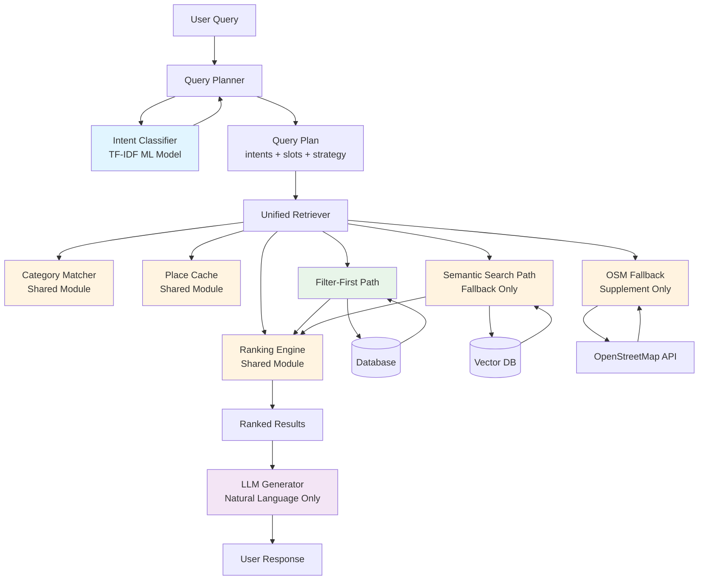

# Design Document: Intent Detection and Retrieval Unification

## Overview

This design establishes a unified architecture for intent detection and retrieval in a RAG-based travel guide chatbot. The current system suffers from code duplication, overlapping intent detection mechanisms, and unclear retrieval strategy selection. This design consolidates these concerns into a clean, maintainable architecture that prioritizes deterministic filtering before LLM involvement.

> **Revision history**
> - v2.5 (2026-03): Added language detection via `langdetect` + keyword fallback, 8 new category domains, improved `open_now` / `min_rating` / `price_max` extraction. See §Language Detection Strategy and §Category Taxonomy for details.

### Design Philosophy: Filter-First Optimization

The core principle of this design is to minimize LLM calls by using deterministic filtering and ranking BEFORE involving the LLM. The architecture follows this flow:

1. **Intent Detection** (TF-IDF classifier) - Fast, deterministic, NO LLM
2. **Filter Extraction** - Extract filters from detected intents, NO LLM
3. **Database Filtering** - Apply deterministic SQL-like filtering, NO LLM
4. **Ranking** - Sort by distance/rating/popularity algorithms, NO LLM
5. **Context Formatting** - Structure place data for LLM
6. **LLM Generation** - ONLY for natural language response generation

The LLM is used exclusively for converting structured, pre-filtered, pre-ranked results into conversational responses. It does NOT participate in filtering, ranking, or place selection.

### Key Design Decisions

1. **Intent_Classifier as Single Source of Truth**: All intent detection flows through the TF-IDF-based Intent_Classifier, eliminating duplicate keyword-based detection
2. **Filter-First as Primary Strategy**: Deterministic filtering is always attempted first; semantic search is only a fallback when filter-first returns zero results
3. **Unified Retriever**: Consolidate Two_Stage_Retriever and Deterministic_Retriever into a single UnifiedRetriever
4. **Shared Modules**: CategoryMatcher, RankingEngine, and PlaceCache are shared across all components
5. **OSM as Supplement**: OpenStreetMap fallback only when database results are insufficient
6. **Clear Separation of Concerns**: Intent Detection → Filtering → Ranking → LLM Generation

## Architecture

### Component Diagram



### Architecture Flow

```
User Query 
  ↓
Query Planner
  ↓
Intent Classifier (TF-IDF) [NO LLM]
  ↓
Extract Filters (category, proximity, price, hours) [NO LLM]
  ↓
Unified Retriever
  ↓
Filter Database (deterministic SQL-like filtering) [NO LLM]
  ↓
Rank Results (distance/rating/popularity algorithms) [NO LLM]
  ↓
Format Context (structured place data)
  ↓
LLM (ONLY for natural language generation)
  ↓
User Response
```

### Retrieval Strategy Hierarchy

The system uses a clear three-tier hierarchy:

1. **Filter-First (Primary)**: Always attempted first for all queries
   - Apply filters: open_now → proximity → category → price → rating
   - Rank by intent-specific criteria
   - Fast, deterministic, predictable

2. **Semantic Search (Fallback)**: Only when Filter-First returns zero results
   - Vector similarity search
   - Re-rank with structured filters
   - Handles vague or ambiguous queries

3. **OSM Fallback (Supplement)**: Only when database results are insufficient
   - Triggered when: empty results, low scores (<0.3), distant results (>5km), verification failures
   - Merges with database results
   - Provides real-time data for places not in database

### Why NOT Semantic RAG as Primary

Semantic/vector search is NOT suitable as the primary retrieval strategy because:

- Cannot understand distance calculations (proximity filtering)
- Cannot understand popularity metrics (Bayesian ranking)
- Cannot understand business hours filtering (open/closed status)
- Cannot understand price ranges (budget filtering)
- Only useful for semantic similarity, not structured criteria

Filter-first handles all these cases deterministically and efficiently.

## Components and Interfaces

### 1. Intent_Classifier

**Purpose**: TF-IDF-based machine learning classifier that detects user intents and categories.

**Responsibilities**:
- Detect intents: location, popularity, price, business_hours, tour_planning, verification
- Detect categories: restaurant, cafe, hotel, bar, museum, etc.
- Provide category keywords for matching
- Single source of truth for all intent detection

**Interface**:
```python
class IntentClassifier:
    def classify(self, query: str) -> IntentResult:
        """
        Classify user query into intents and categories.
        
        Args:
            query: User's natural language query
            
        Returns:
            IntentResult with detected intents, categories, and confidence scores
        """
        pass
    
    def get_category_keywords(self, category: str) -> List[str]:
        """
        Get all keywords associated with a category.
        
        Args:
            category: Category name (e.g., 'restaurant', 'cafe')
            
        Returns:
            List of keywords for the category
        """
        pass
    
    def retrain(self, training_data: List[TrainingExample]) -> None:
        """
        Retrain the classifier with new training data.
        
        Args:
            training_data: List of labeled examples
        """
        pass

@dataclass
class IntentResult:
    intents: Dict[str, float]  # intent_name -> confidence
    categories: Dict[str, float]  # category_name -> confidence
    proximity_detected: bool
    keywords: List[str]
```

### 2. Query_Planner

**Purpose**: Converts user messages into structured Query Plans by delegating to Intent_Classifier.

**Responsibilities**:
- Detect language (Portuguese/English)
- Delegate intent detection to Intent_Classifier
- Extract slots (location, category, price, hours, etc.)
- Select retrieval strategy (filter_first, semantic_fallback, osm_enabled)
- Create Query Plan for Unified Retriever

**Interface**:
```python
class QueryPlanner:
    def __init__(self, intent_classifier: IntentClassifier):
        self.intent_classifier = intent_classifier
    
    def plan(self, message: str, user_location: Optional[Location]) -> QueryPlan:
        """
        Create a query plan from user message.
        
        Args:
            message: User's natural language query
            user_location: User's current location (if available)
            
        Returns:
            QueryPlan with intents, slots, and retrieval strategy
        """
        pass
    
    def _extract_slots(self, message: str, intent_result: IntentResult) -> Dict[str, Any]:
        """Extract structured slots from message and intent result."""
        pass
    
    def _select_strategy(self, intent_result: IntentResult, user_location: Optional[Location]) -> RetrievalStrategy:
        """Select retrieval strategy based on intents and context."""
        pass

@dataclass
class QueryPlan:
    language: str  # 'pt' or 'en'
    intents: Dict[str, float]
    slots: Dict[str, Any]  # category, proximity_radius, price_range, open_now, etc.
    retrieval_strategy: RetrievalStrategy
    proximity_intent_detected: bool
    user_location: Optional[Location]

@dataclass
class RetrievalStrategy:
    primary: str  # 'filter_first'
    fallback: str  # 'semantic_search'
    osm_enabled: bool
```

### 3. Unified_Retriever

**Purpose**: Single consolidated retriever that handles all retrieval strategies.

**Responsibilities**:
- Execute filter-first retrieval (primary)
- Execute semantic search (fallback only)
- Trigger OSM fallback when needed
- Merge and rank results
- Delegate to shared modules (CategoryMatcher, RankingEngine, PlaceCache)

**Interface**:
```python
class UnifiedRetriever:
    def __init__(
        self,
        place_cache: PlaceCache,
        category_matcher: CategoryMatcher,
        ranking_engine: RankingEngine,
        vector_store: Optional[VectorStore] = None,
        osm_client: Optional[OSMClient] = None
    ):
        self.place_cache = place_cache
        self.category_matcher = category_matcher
        self.ranking_engine = ranking_engine
        self.vector_store = vector_store
        self.osm_client = osm_client
    
    def retrieve(self, query_plan: QueryPlan) -> RetrievalResult:
        """
        Retrieve and rank places based on query plan.
        
        Args:
            query_plan: Structured query plan from Query_Planner
            
        Returns:
            RetrievalResult with ranked places and metadata
        """
        pass
    
    def _filter_first(self, query_plan: QueryPlan) -> List[Place]:
        """Apply deterministic filters to database."""
        pass
    
    def _semantic_search(self, query_plan: QueryPlan) -> List[Place]:
        """Perform vector similarity search (fallback only)."""
        pass
    
    def _osm_fallback(self, query_plan: QueryPlan, db_results: List[Place]) -> List[Place]:
        """Supplement with OSM results if needed."""
        pass
    
    def _should_trigger_osm(self, db_results: List[Place], query_plan: QueryPlan) -> bool:
        """Determine if OSM fallback should be triggered."""
        pass

@dataclass
class RetrievalResult:
    places: List[Place]
    strategy_used: str  # 'filter_first', 'semantic_search', 'osm_fallback'
    osm_triggered: bool
    filters_applied: List[str]
    ranking_mode: str
    total_candidates: int
```

### 4. Category_Matcher (Shared Module)

**Purpose**: Consistent category matching logic used by all components.

**Responsibilities**:
- Match place categories against query categories
- Handle special cases (açaí vs cafe, hotel vs motel)
- Use Intent_Classifier keywords as authoritative source

**Interface**:
```python
class CategoryMatcher:
    def __init__(self, intent_classifier: IntentClassifier):
        self.intent_classifier = intent_classifier
        self._special_cases = self._load_special_cases()
    
    def matches(self, place: Place, query_categories: List[str]) -> bool:
        """
        Check if place matches any of the query categories.
        
        Args:
            place: Place to check
            query_categories: List of category names from query
            
        Returns:
            True if place matches any category
        """
        pass
    
    def get_match_score(self, place: Place, query_categories: List[str]) -> float:
        """
        Calculate category match score (0.0 to 1.0).
        
        Args:
            place: Place to score
            query_categories: List of category names from query
            
        Returns:
            Match score between 0.0 and 1.0
        """
        pass
    
    def _load_special_cases(self) -> Dict[str, List[str]]:
        """Load special case mappings (açaí->cafe, hotel->motel, etc.)."""
        pass
```

### 5. Ranking_Engine (Shared Module)

**Purpose**: Consistent ranking logic used by all retrievers.

**Responsibilities**:
- Rank by distance (ascending with rating tiebreaker)
- Rank by rating (descending with review count tiebreaker)
- Rank by popularity (Bayesian score descending)
- Rank by best_match (composite: 45% rating, 35% popularity, 20% proximity)

**Interface**:
```python
class RankingEngine:
    def rank(self, places: List[Place], mode: RankingMode, user_location: Optional[Location]) -> List[Place]:
        """
        Rank places according to specified mode.
        
        Args:
            places: List of places to rank
            mode: Ranking mode (distance, rating, popularity, best_match)
            user_location: User location for distance calculations
            
        Returns:
            Sorted list of places
        """
        pass
    
    def _rank_by_distance(self, places: List[Place], user_location: Location) -> List[Place]:
        """Sort by distance ascending, rating as tiebreaker."""
        pass
    
    def _rank_by_rating(self, places: List[Place]) -> List[Place]:
        """Sort by totalScore descending, reviewsCount as tiebreaker."""
        pass
    
    def _rank_by_popularity(self, places: List[Place]) -> List[Place]:
        """Sort by Bayesian popularity score descending."""
        pass
    
    def _rank_by_best_match(self, places: List[Place], user_location: Optional[Location]) -> List[Place]:
        """Composite scoring: 45% rating, 35% popularity, 20% proximity."""
        pass
    
    def _calculate_bayesian_score(self, place: Place) -> float:
        """Calculate Bayesian popularity score."""
        pass

@dataclass
class RankingMode:
    DISTANCE = "distance"
    RATING = "rating"
    POPULARITY = "popularity"
    BEST_MATCH = "best_match"
```

### 6. Place_Cache (Shared Module)

**Purpose**: Unified place data access and caching.

**Responsibilities**:
- Cache place data for fast lookup
- Support lookup by title, titleFormatted, placeId
- Provide consistent data access for all retrievers

**Interface**:
```python
class PlaceCache:
    def __init__(self, database: Database):
        self.database = database
        self._cache: Dict[str, Place] = {}
    
    def get_by_id(self, place_id: str) -> Optional[Place]:
        """Get place by placeId."""
        pass
    
    def get_by_title(self, title: str) -> Optional[Place]:
        """Get place by title or titleFormatted."""
        pass
    
    def get_all(self) -> List[Place]:
        """Get all places from database."""
        pass
    
    def filter(self, predicate: Callable[[Place], bool]) -> List[Place]:
        """Filter places by predicate function."""
        pass
    
    def invalidate(self) -> None:
        """Clear cache."""
        pass
```

### 7. OSM_Client

**Purpose**: Interface to OpenStreetMap Overpass API for real-time place data.

**Responsibilities**:
- Search OSM for places by category and location
- Convert OSM data to Place objects
- Handle API rate limiting and errors

**Interface**:
```python
class OSMClient:
    def search(
        self,
        category: str,
        location: Location,
        radius_km: float = 2.0
    ) -> List[Place]:
        """
        Search OpenStreetMap for places.
        
        Args:
            category: Place category (restaurant, cafe, etc.)
            location: Center point for search
            radius_km: Search radius in kilometers
            
        Returns:
            List of places from OSM
        """
        pass
    
    def _convert_osm_to_place(self, osm_element: Dict) -> Place:
        """Convert OSM element to Place object."""
        pass
```

## Data Models

### Place

```python
@dataclass
class Place:
    placeId: str
    title: str
    titleFormatted: str
    category: List[str]
    location: Location
    totalScore: float  # Rating score
    reviewsCount: int
    priceRange: Optional[str]  # '$', '$$', '$$$', '$$$$'
    businessHours: Optional[BusinessHours]
    description: Optional[str]
    address: Optional[str]
    phone: Optional[str]
    website: Optional[str]
    source: str  # 'database' or 'osm'
```

### Location

```python
@dataclass
class Location:
    latitude: float
    longitude: float
    
    def distance_to(self, other: Location) -> float:
        """Calculate distance in kilometers using Haversine formula."""
        pass
```

### BusinessHours

```python
@dataclass
class BusinessHours:
    monday: Optional[str]
    tuesday: Optional[str]
    wednesday: Optional[str]
    thursday: Optional[str]
    friday: Optional[str]
    saturday: Optional[str]
    sunday: Optional[str]
    
    def is_open_now(self, current_time: datetime) -> bool:
        """Check if place is currently open."""
        pass
```

### Intent-to-Retrieval Mapping

This table documents how each detected intent maps to retrieval behavior:

| Intent | Filter Applied | Ranking Mode | Notes |
|--------|---------------|--------------|-------|
| location | Proximity filter (0.5km → 1km → 2km radius escalation) | distance | Only when proximity keywords present |
| popularity | None | popularity | Bayesian score ranking |
| business_hours | Open now filter | best_match | Filters closed places |
| price | Price range filter | best_match | Filters by budget |
| tour_planning | None | N/A | Routes to tour planner component |
| verification | Exact name match | best_match | Triggers OSM fallback if not found |
| (no specific intent) | Category only | best_match | Default behavior |

### Filtering Precedence

Filters are applied in this order (rationale: most restrictive first):

1. **open_now**: Eliminates closed places immediately (binary filter)
2. **proximity**: Reduces search space geographically (when proximity intent detected)
3. **category**: Narrows to relevant place types
4. **price**: Filters by budget constraints
5. **rating**: Minimum rating threshold (if specified)

### OSM Fallback Trigger Conditions

OSM fallback is triggered when ANY of these conditions are met:

1. Database results are empty
2. All database result scores < 0.3 (low quality)
3. Nearest database result > 5km AND proximity intent detected
4. Verification intent detected AND specific place name not found in database


## Correctness Properties

*A property is a characteristic or behavior that should hold true across all valid executions of a system-essentially, a formal statement about what the system should do. Properties serve as the bridge between human-readable specifications and machine-verifiable correctness guarantees.*

### Property 1: Filter-First as Primary Strategy

*For any* query processed by the Unified_System, the filter-first retrieval strategy should be attempted before any other retrieval strategy.

**Validates: Requirements 2.2, 9.1**

### Property 2: Semantic Search Fallback

*For any* query where filter-first retrieval returns zero results, the system should automatically fall back to semantic search.

**Validates: Requirements 2.3, 9.2**

### Property 3: OSM Supplementation

*For any* query where database results are insufficient (empty, low quality scores, or distant) AND user location is available, the system should supplement results with OSM fallback.

**Validates: Requirements 2.4**

### Property 4: Multi-Filter Support

*For any* combination of filters (open hours, proximity, category, price, rating), the unified retriever should correctly apply all specified filters to the result set.

**Validates: Requirements 4.2**

### Property 5: Multi-Ranking Support

*For any* ranking mode (distance, rating, popularity, best_match), the unified retriever should correctly order results according to that mode's algorithm.

**Validates: Requirements 4.3**

### Property 6: Query Plan Backward Compatibility

*For any* valid Query_Plan from the legacy system, the unified retriever should process it correctly and produce equivalent results.

**Validates: Requirements 4.5**

### Property 7: Proximity Intent Handling

*For any* query, proximity filtering should be applied if and only if proximity keywords are present in the query AND user location is available, with radius escalation (0.5km → 1km → 2km) when results are insufficient.

**Validates: Requirements 5.2, 6.1, 6.2, 6.3, 6.4**

### Property 8: Popularity Intent Ranking

*For any* query with popularity intent detected, the system should rank results by Bayesian popularity score in descending order.

**Validates: Requirements 5.3**

### Property 9: Business Hours Intent Filtering

*For any* query with business_hours intent detected, the system should filter results to include only places that are currently open.

**Validates: Requirements 5.4**

### Property 10: Price Intent Filtering

*For any* query with price intent detected, the system should filter results to include only places within the specified price range.

**Validates: Requirements 5.5**

### Property 11: Tour Planning Intent Routing

*For any* query with tour_planning intent detected, the system should route the request to the tour planner component rather than the standard retrieval pipeline.

**Validates: Requirements 5.6**

### Property 12: Verification Intent Prioritization

*For any* query with verification intent detected, the system should prioritize exact name matching and trigger OSM fallback if the specific place is not found in the database.

**Validates: Requirements 5.7**

### Property 13: Distance Calculation Invariant

*For any* query result with user location available, distance should be calculated and included in the response regardless of whether proximity filtering was applied.

**Validates: Requirements 6.5**

### Property 14: Filter Precedence Order

*For any* query with multiple filters, the system should apply filters in the following order: open_now, proximity, category, price, rating.

**Validates: Requirements 8.1, 8.2, 8.3, 8.4**

### Property 15: OSM Enabled with Location

*For any* query where user location is available, the OSM fallback option should be enabled in the retrieval strategy.

**Validates: Requirements 9.3**

### Property 16: Distance Ranking Correctness

*For any* list of places ranked by distance mode, the results should be sorted by distance ascending with rating as tiebreaker for equal distances.

**Validates: Requirements 10.3**

### Property 17: Rating Ranking Correctness

*For any* list of places ranked by rating mode, the results should be sorted by totalScore descending with reviewsCount as tiebreaker for equal ratings.

**Validates: Requirements 10.4**

### Property 18: Popularity Ranking Correctness

*For any* list of places ranked by popularity mode, the results should be sorted by Bayesian popularity score in descending order.

**Validates: Requirements 10.5**

### Property 19: Best Match Ranking Correctness

*For any* list of places ranked by best_match mode, the results should be sorted by composite score using weights: 45% rating, 35% popularity, 20% proximity.

**Validates: Requirements 10.6**

### Property 20: Place Lookup by Multiple Keys

*For any* place in the database, lookup by placeId, title, or titleFormatted should return the same place object.

**Validates: Requirements 11.3**

### Property 21: OSM Quality Evaluation

*For any* database results, the system should evaluate result quality (emptiness, score threshold, distance threshold) before deciding whether to trigger OSM fallback.

**Validates: Requirements 12.1**

### Property 22: OSM Trigger on Empty Results

*For any* query that returns zero database results, the system should trigger OSM fallback (when location is available).

**Validates: Requirements 12.2**

### Property 23: OSM Trigger on Low Quality

*For any* query where all database result scores are below 0.3, the system should trigger OSM fallback (when location is available).

**Validates: Requirements 12.3**

### Property 24: OSM Trigger on Distant Results

*For any* query with proximity intent where the nearest database result is beyond 5km, the system should trigger OSM fallback (when location is available).

**Validates: Requirements 12.4**

### Property 25: OSM Trigger on Verification Failure

*For any* query with verification intent where the specific place name is not found in the database, the system should trigger OSM fallback (when location is available).

**Validates: Requirements 12.5**

### Property 26: OSM Result Merging

*For any* query that returns both database results and OSM results, the system should merge them into a single ranked list using the appropriate ranking mode.

**Validates: Requirements 12.6**

### Property 27: Proximity Keyword Detection

*For any* query containing proximity keywords (near, nearby, close, closest, around, etc.), the Intent_Classifier should detect location intent.

**Validates: Requirements 14.2**

### Property 28: Popularity Keyword Detection

*For any* query containing popularity keywords (popular, best, top, famous, recommended, etc.), the Intent_Classifier should detect popularity intent.

**Validates: Requirements 14.3**

### Property 29: Business Hours Keyword Detection

*For any* query containing business hours keywords (open, closed, open now, hours, etc.), the Intent_Classifier should detect business_hours intent.

**Validates: Requirements 14.4**

### Property 30: Category Keyword Detection

*For any* query containing category keywords (restaurant, cafe, hotel, bar, museum, etc.), the Intent_Classifier should detect the correct category.

**Validates: Requirements 14.5**

### Property 31: Query Plan Serialization Round-Trip

*For any* valid Query_Plan object, serializing to JSON and then deserializing should produce an equivalent Query_Plan object.

**Validates: Requirements 14.6**

## Error Handling

### Intent Classifier Failures

**Scenario**: Intent_Classifier is unavailable or raises an exception

**Handling**:
- Query_Planner falls back to minimal keyword-based detection
- Log error with full context (query, exception, timestamp)
- Return Query_Plan with default strategy (filter_first)
- Set confidence scores to 0.0 to indicate fallback mode
- Continue processing rather than failing the request

**Example**:
```python
try:
    intent_result = self.intent_classifier.classify(query)
except Exception as e:
    logger.error(f"Intent_Classifier failed: {e}", extra={"query": query})
    intent_result = self._fallback_intent_detection(query)
    intent_result.fallback_mode = True
```

### Empty Results Handling

**Scenario**: All retrieval strategies return zero results

**Handling**:
- Log the query and all strategies attempted
- Return empty result set with metadata explaining why
- Suggest query refinements to user (broader category, remove filters, etc.)
- Do NOT fail silently

**Example**:
```python
if not results:
    logger.warning(
        "No results found",
        extra={
            "query": query_plan.original_query,
            "strategies_tried": ["filter_first", "semantic_search", "osm_fallback"],
            "filters_applied": query_plan.slots
        }
    )
    return RetrievalResult(
        places=[],
        strategy_used="none",
        suggestion="Try broadening your search or removing filters"
    )
```

### OSM API Failures

**Scenario**: OSM Overpass API is unavailable, rate-limited, or returns errors

**Handling**:
- Catch all OSM exceptions
- Log error with query context
- Return database results only (do not fail entire request)
- Set osm_triggered=False in metadata
- Optionally cache OSM failures to avoid repeated attempts

**Example**:
```python
try:
    osm_results = self.osm_client.search(category, location, radius)
except OSMAPIError as e:
    logger.error(f"OSM API failed: {e}", extra={"category": category, "location": location})
    osm_results = []
    # Continue with database results only
```

### Invalid Query Plans

**Scenario**: Query_Plan contains invalid or contradictory slots

**Handling**:
- Validate Query_Plan before retrieval
- Log validation errors
- Apply sensible defaults for invalid values
- Continue processing with corrected plan

**Example**:
```python
def _validate_query_plan(self, query_plan: QueryPlan) -> QueryPlan:
    if query_plan.slots.get("proximity_radius", 0) > 50:
        logger.warning(f"Invalid proximity_radius: {query_plan.slots['proximity_radius']}, capping at 50km")
        query_plan.slots["proximity_radius"] = 50
    
    if query_plan.slots.get("price_range") not in ["$", "$$", "$$$", "$$$$", None]:
        logger.warning(f"Invalid price_range: {query_plan.slots['price_range']}, ignoring")
        query_plan.slots["price_range"] = None
    
    return query_plan
```

### Database Connection Failures

**Scenario**: Database is unavailable or queries timeout

**Handling**:
- Implement retry logic with exponential backoff (3 attempts)
- Fall back to OSM-only results if database is completely unavailable
- Log all database errors with full context
- Return partial results if some queries succeed

**Example**:
```python
@retry(max_attempts=3, backoff=exponential_backoff)
def _query_database(self, filters: Dict) -> List[Place]:
    try:
        return self.place_cache.filter(filters)
    except DatabaseError as e:
        logger.error(f"Database query failed: {e}", extra={"filters": filters})
        raise
```

### Category Matching Failures

**Scenario**: Place has unknown or malformed category data

**Handling**:
- Log unknown categories for future training data
- Use fuzzy matching for close matches
- Include place in results if other filters match (don't exclude due to category uncertainty)
- Track category matching confidence in metadata

**Example**:
```python
def matches(self, place: Place, query_categories: List[str]) -> bool:
    if not place.category:
        logger.warning(f"Place has no category: {place.placeId}")
        return True  # Include rather than exclude
    
    for place_cat in place.category:
        if place_cat not in self.known_categories:
            logger.info(f"Unknown category: {place_cat}", extra={"place_id": place.placeId})
        
        if self._fuzzy_match(place_cat, query_categories):
            return True
    
    return False
```

## Language Detection Strategy

Language detection determines whether a query is in English (`en`) or Brazilian Portuguese (`pt-BR`). The strategy runs in three ordered steps:

### Step 1 — Explicit language override
If the client sends an explicit `language` field (e.g. `"pt-BR"`, `"pt"`, `"en"`), that value is used directly and no further detection is performed.

### Step 2 — `langdetect` library
When the `langdetect` package is installed and the query is at least 5 characters long, `langdetect.detect()` is called. If it returns `"pt"` the language is set to `pt-BR`. For any other language code the result is noted but the keyword fallback (Step 3) is still run as a safety net for short or ambiguous queries.

`langdetect` is imported once at `QueryPlanner.__init__` time. A boolean flag `_langdetect_available` is set so that the runtime cost of a failed import is paid only once.

```python
# Initialisation (once)
try:
    from langdetect import detect, LangDetectException
    self._langdetect_available = True
except ImportError:
    self._langdetect_available = False
```

Install with: `pip install langdetect`

### Step 3 — Keyword fallback
A curated set `_PT_BR_KEYWORDS` (~80 unambiguous Portuguese words) is checked against the tokenised query. If any word in the query matches the set, the language is `pt-BR`. This covers:
- Slang and colloquial terms (`bora`, `massa`, `cara`, `tipo`)
- Place-type nouns that do not exist in English (`padaria`, `churrascaria`, `barbearia`, `petshop`, …)
- Common verbs and pronouns (`quero`, `preciso`, `perto`, `agora`, …)

The keyword set is intentionally conservative — only words that are unambiguous Portuguese are included, to avoid false positives on English queries that happen to contain a Portuguese-looking word.

### Rationale
- `langdetect` handles typos, mixed-language queries, and slang better than pure keyword matching.
- The keyword fallback ensures correctness when `langdetect` is not installed or returns low-confidence results for very short queries.
- Explicit language override allows clients to bypass detection entirely when the language is already known.

---

## Category Taxonomy (v2.5)

The `SimpleTFIDFIntentClassifier` is the single source of truth for all category keywords. As of model version `2.5` the following 16 category domains are supported:

| Domain | Key PT-BR terms | Key EN terms |
|---|---|---|
| `restaurant` | restaurante, churrascaria, pizzaria, lanchonete | restaurant, food, dining, grill |
| `acai` | açaí, açaizeiro, tigela de açaí | acai, acai bowl |
| `cafe` | padaria, confeitaria, cafeteria | cafe, coffee, bakery |
| `ice_cream` | sorveteria, sorvete, picolé | ice cream, gelato |
| `hotel` | pousada, hospedagem, hostel | hotel, accommodation, lodging |
| `bar` | boteco, cerveja, bebidas | bar, pub, drinks |
| `shopping` | loja, comprar, mercado | shop, mall, store |
| `entertainment` | cinema, teatro, diversão | cinema, theater, fun |
| `tourist_attraction` | ponto turístico, museu, parque, praia | museum, park, beach, landmark |
| `health` *(new)* | clínica, farmácia, médico, UBS, UPA | clinic, pharmacy, doctor |
| `beauty` *(new)* | salão, cabeleireiro, manicure, barbearia | hair salon, barber, nail salon |
| `automotive` *(new)* | oficina, mecânica, lava-jato, borracharia | auto repair, car wash, tire shop |
| `wellness` *(new)* | academia, spa, massagem, pilates, yoga | gym, spa, massage, fitness |
| `pets` *(new)* | petshop, veterinário, banho e tosa | pet store, vet, grooming |
| `nightlife` *(new)* | balada, boate, show ao vivo, karaokê | nightclub, live music, karaoke |
| `kids` *(new)* | brinquedoteca, parquinho, buffet infantil | playground, kids party, toy store |
| `sports` *(new)* | quadra, piscina, academia, estádio | court, pool, stadium, gym |

When category keywords are updated, `MODEL_VERSION` must be bumped so that the cached `.pkl` model file is invalidated and the classifier is retrained automatically on next startup.

---

## Filter Extraction Details

### `open_now` Extraction

`extract_open_now()` uses a two-strategy approach so that open-now detection is independent of the primary intent:

**Strategy 1 — Direct phrase matching (language-agnostic)**
A hardcoded list of phrases is checked against the normalised message. This fires regardless of what the primary intent is (e.g. a popularity query that also says "aberto agora" will still set `open_now=True`).

PT-BR phrases: `aberto agora`, `aberta agora`, `funcionando agora`, `aberto 24 horas`, `que esteja aberto`, `ainda aberto`, `aberto hoje`, …

EN phrases: `open now`, `currently open`, `open right now`, `open 24 hours`, `still open`, `open today`, …

**Strategy 2 — Intent classifier `business_hours` signal**
If the classifier's primary intent is `business_hours`, the message is scanned for open-keywords (`aberto`, `open`, `funcionando`) vs closed-keywords (`fechado`, `closed`). `open_now=True` is set only when open-keywords are present and closed-keywords are absent.

### `min_rating` Extraction

`extract_min_rating()` handles both numeric and qualitative expressions:

**Numeric patterns (regex)**

| Pattern | Example |
|---|---|
| `(\d+\.?\d*)\s*\+` | "4.5+" |
| `rating\s*[>>=]+\s*(\d+\.?\d*)` | "rating >= 4" |
| `nota\s*[>>=]+\s*(\d+\.?\d*)` | "nota >= 4" |
| `nota\s+acima\s+de\s+(\d+\.?\d*)` | "nota acima de 4" |
| `acima\s+de\s+(\d+\.?\d*)\s*estrela` | "acima de 4 estrelas" |
| `pelo\s+menos\s+(\d+\.?\d*)\s*estrela` | "pelo menos 4 estrelas" |
| `minimo\s+de\s+(\d+\.?\d*)` | "mínimo de 4" |
| `no\s+minimo\s+(\d+\.?\d*)` | "no mínimo 4" |
| `(\d+\.?\d*)\s*estrelas?\s+ou\s+mais` | "4 estrelas ou mais" |
| `score\s*[>>=]+\s*(\d+\.?\d*)` | "score >= 4" |

**Qualitative map**

| Term | Threshold |
|---|---|
| `altamente avaliado` / `highly rated` / `top rated` | 4.5 |
| `excelente` / `excellent` / `melhor avaliado` | 4.5 |
| `bem avaliado` / `well rated` / `great` | 4.0 |
| `ótimo` / `muito bom` | 4.0 |

### `price_max` Extraction

`extract_price_max()` is now language-agnostic and covers both cheap and luxury signals:

**Cheap keywords → `price_max = 2.0`**

PT-BR: `barato`, `econômico`, `em conta`, `bom preço`, `acessível`, `custo-benefício`, `não muito caro`, `preço baixo`

EN: `cheap`, `inexpensive`, `affordable`, `budget`, `low cost`

**Luxury keywords → `price_max = 4.0`**

PT-BR: `caro`, `luxo`, `luxuoso`, `premium`, `sofisticado`, `requintado`

EN: `expensive`, `luxury`, `upscale`, `fine dining`, `high-end`

**Numeric patterns**: `price <= N`, `preço <= N`, `$N`, `até N`

---

## Testing Strategy

### Dual Testing Approach

This feature requires both unit tests and property-based tests for comprehensive coverage:

**Unit Tests**: Focus on specific examples, edge cases, and integration points
- Intent classifier fallback behavior when unavailable
- Special case category matching (açaí vs cafe, hotel vs motel)
- OSM trigger logging and metadata
- Error handling scenarios (API failures, invalid inputs)
- Integration between Query_Planner and Intent_Classifier

**Property-Based Tests**: Verify universal properties across all inputs
- Intent detection correctness across all keyword variations
- Filter application correctness for all filter combinations
- Ranking correctness for all ranking modes
- Query Plan serialization round-trips
- Retrieval strategy selection logic

### Property-Based Testing Configuration

**Framework**: Use `hypothesis` for Python (or `fast-check` for TypeScript/JavaScript)

**Configuration**:
- Minimum 100 iterations per property test (due to randomization)
- Each property test must reference its design document property
- Tag format: `# Feature: intent-detection-unification, Property {number}: {property_text}`

**Example Property Test**:
```python
from hypothesis import given, strategies as st

@given(
    query=st.text(min_size=1),
    proximity_keywords=st.sampled_from(["near", "nearby", "close", "closest", "around"])
)
def test_proximity_keyword_detection(query, proximity_keyword):
    """
    Feature: intent-detection-unification
    Property 27: For any query containing proximity keywords, 
    the Intent_Classifier should detect location intent.
    """
    query_with_proximity = f"{query} {proximity_keyword}"
    result = intent_classifier.classify(query_with_proximity)
    
    assert "location" in result.intents
    assert result.intents["location"] > 0.5
    assert result.proximity_detected is True
```

### Test Data Generators

**Place Generator**:
```python
@st.composite
def place_strategy(draw):
    return Place(
        placeId=draw(st.uuids()).hex,
        title=draw(st.text(min_size=1, max_size=50)),
        titleFormatted=draw(st.text(min_size=1, max_size=50)),
        category=draw(st.lists(st.sampled_from(KNOWN_CATEGORIES), min_size=1, max_size=3)),
        location=Location(
            latitude=draw(st.floats(min_value=-90, max_value=90)),
            longitude=draw(st.floats(min_value=-180, max_value=180))
        ),
        totalScore=draw(st.floats(min_value=0, max_value=5)),
        reviewsCount=draw(st.integers(min_value=0, max_value=10000)),
        priceRange=draw(st.sampled_from(["$", "$$", "$$$", "$$$$", None])),
        businessHours=draw(st.none() | business_hours_strategy()),
        source="database"
    )
```

**Query Plan Generator**:
```python
@st.composite
def query_plan_strategy(draw):
    return QueryPlan(
        language=draw(st.sampled_from(["pt", "en"])),
        intents=draw(st.dictionaries(
            keys=st.sampled_from(["location", "popularity", "price", "business_hours"]),
            values=st.floats(min_value=0, max_value=1)
        )),
        slots=draw(st.dictionaries(
            keys=st.sampled_from(["category", "proximity_radius", "price_range", "open_now"]),
            values=st.one_of(st.text(), st.floats(), st.booleans(), st.none())
        )),
        retrieval_strategy=RetrievalStrategy(
            primary="filter_first",
            fallback="semantic_search",
            osm_enabled=draw(st.booleans())
        ),
        proximity_intent_detected=draw(st.booleans()),
        user_location=draw(st.none() | location_strategy())
    )
```

### Unit Test Examples

**Test Intent Classifier Fallback**:
```python
def test_intent_classifier_fallback_on_failure():
    """
    When Intent_Classifier fails, Query_Planner should use minimal fallback
    and log the error.
    """
    # Mock Intent_Classifier to raise exception
    intent_classifier = Mock(spec=IntentClassifier)
    intent_classifier.classify.side_effect = Exception("Classifier unavailable")
    
    query_planner = QueryPlanner(intent_classifier)
    
    with patch('logging.Logger.error') as mock_log:
        query_plan = query_planner.plan("find restaurants nearby", None)
        
        # Should return a valid query plan with fallback
        assert query_plan is not None
        assert query_plan.retrieval_strategy.primary == "filter_first"
        
        # Should log the error
        mock_log.assert_called_once()
        assert "Intent_Classifier failed" in str(mock_log.call_args)
```

**Test Special Case Category Matching**:
```python
def test_category_matcher_special_cases():
    """
    Category matcher should handle special cases like açaí vs cafe.
    """
    matcher = CategoryMatcher(intent_classifier)
    
    # Açaí place should match cafe query
    acai_place = Place(category=["açaí"], ...)
    assert matcher.matches(acai_place, ["cafe"]) is True
    
    # Hotel should match motel query
    hotel_place = Place(category=["hotel"], ...)
    assert matcher.matches(hotel_place, ["motel"]) is True
```

**Test OSM Trigger Logging**:
```python
def test_osm_trigger_logging():
    """
    System should log when OSM fallback is triggered and why.
    """
    retriever = UnifiedRetriever(...)
    query_plan = QueryPlan(...)
    
    with patch('logging.Logger.info') as mock_log:
        # Simulate empty database results
        with patch.object(retriever, '_filter_first', return_value=[]):
            result = retriever.retrieve(query_plan)
            
            # Should log OSM trigger
            mock_log.assert_called()
            log_message = str(mock_log.call_args)
            assert "OSM_Fallback triggered" in log_message
            assert "reason: empty_results" in log_message
```

### Integration Tests

**Test End-to-End Query Flow**:
```python
def test_end_to_end_query_flow():
    """
    Test complete flow from user query to ranked results.
    """
    # Setup
    intent_classifier = IntentClassifier()
    query_planner = QueryPlanner(intent_classifier)
    retriever = UnifiedRetriever(...)
    
    # Execute
    query = "find popular restaurants near me"
    user_location = Location(latitude=-23.5505, longitude=-46.6333)
    
    query_plan = query_planner.plan(query, user_location)
    results = retriever.retrieve(query_plan)
    
    # Verify
    assert results.strategy_used == "filter_first"
    assert "location" in query_plan.intents
    assert "popularity" in query_plan.intents
    assert query_plan.proximity_intent_detected is True
    assert len(results.places) > 0
    assert results.ranking_mode == "popularity"
```

### Test Coverage Goals

- Unit test coverage: >90% for all modules
- Property test coverage: All 31 correctness properties implemented
- Integration test coverage: All major user flows (proximity search, popularity search, verification, tour planning)
- Error handling coverage: All error scenarios tested

### Continuous Testing

- Run unit tests on every commit
- Run property tests (100 iterations) on every PR
- Run extended property tests (1000 iterations) nightly
- Monitor test execution time and optimize slow tests
- Track property test failure rates to identify flaky tests
