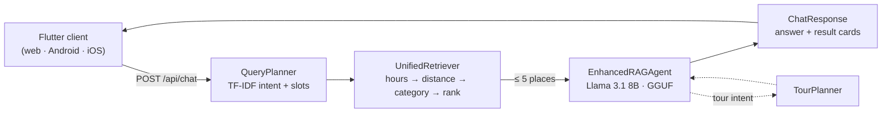

<div align="center">


# BelemConverse

**Grounded, bilingual place discovery for Belém do Pará.**<br>
Ask where to go in Portuguese or English — get answers built only from places that actually exist.

<!-- Project -->
[](docs/spec/00-poc-charter.md)
[](LICENSE)
[](pyproject.toml)
[](https://mollinetti.github.io/BelemConverse/)
[](https://cop30.br/pt-br)
[](https://github.com/Mollinetti/BelemConverse/commits/main)
[](https://github.com/Mollinetti/BelemConverse/stargazers)

<!-- Stack -->
[](https://fastapi.tiangolo.com/)
[](https://docs.pydantic.dev/)
[](https://flutter.dev/)
[](https://dart.dev/)
[](https://huggingface.co/meta-llama/Llama-3.1-8B-Instruct)
[](https://github.com/abetlen/llama-cpp-python)
[](https://www.sbert.net/)
[](https://www.trychroma.com/)
[](https://scikit-learn.org/)
[](https://www.openstreetmap.org/)
[](Dockerfile)
[](tests/)
[](https://github.com/astral-sh/ruff)

[**Project site**](https://mollinetti.github.io/BelemConverse/) ·
[**Specs**](docs/spec/) ·
[**API contract**](docs/spec/05-openapi.yaml) ·
[**Authors**](https://mollinetti.github.io/BelemConverse/authors.html)

<br>

<a href="https://mollinetti.github.io/BelemConverse/">
  
</a>

<sub>From the <a href="https://mollinetti.github.io/BelemConverse/">project site</a>. Queries are real; figures are illustrative.</sub>

</div>

---

## Table of contents

- [Why](#why)
- [What it does](#what-it-does)
- [How it works](#how-it-works)
- [Example queries](#example-queries)
- [Getting started](#getting-started)
- [Running with Docker](#running-with-docker)
- [Configuration](#configuration)
- [API](#api)
- [Project structure](#project-structure)
- [Testing](#testing)
- [Specifications](#specifications)
- [Contributing](#contributing)
- [Authors](#authors)
- [Acknowledgements](#acknowledgements)
- [License](#license)

## Why

In November 2025 Belém hosted [COP30](https://cop30.br/pt-br), the UN climate
conference, and tens of thousands of visitors arrived in a city most of them
had never seen. General-purpose search serves São Paulo and Rio far better than
it serves Belém — and general-purpose chatbots will happily recommend a
restaurant that closed years ago, or never existed.

BelemConverse answers the ordinary questions a visitor or resident actually
asks — *what's open, what's close, what's good* — from a curated index of local
places, in the language they asked in. The language model never searches; it
only describes what deterministic retrieval hands it.

## What it does

- **Understands how people really ask.** A TF-IDF intent classifier handles
  formal and colloquial phrasing in both languages — *"Closest restaurants open
  now"* and *"cadê uma barbearia bacana aqui pertinho?"* alike.
- **Filters before it ranks.** Opening hours, then proximity with a radius that
  escalates 500 m → 1 km → 2 km, then category. Rating and popularity only
  reorder what survives.
- **Cannot invent a place.** At most five retrieved candidates reach the model,
  which is contractually limited to summarising them.
- **Says so when nothing matches.** Zero results after full escalation produces
  a clarifying question, not a plausible substitute.
- **Plans short itineraries.** Tour-planning requests (*"plan a tour"*,
  *"roteiro"*) build an itinerary from the same index.
- **Runs entirely locally.** GGUF Llama via `llama.cpp`, local embeddings,
  local vector store. No API keys, no cloud inference.

## How it works



| Stage | Component | Responsibility |
| --- | --- | --- |
| **Plan** | `QueryPlanner` | Turns the message into a structured plan: intent, category, open-now, sort mode, language. Falls back to keyword matching if the classifier is unavailable. |
| **Retrieve** | `UnifiedRetriever` | Applies filters in fixed precedence, escalates the radius until five results exist, then ranks. Vector search exists only as a gated fallback and never overrides geography or hours. |
| **Answer** | `EnhancedRAGAgent` | Summarises the retrieved places in EN or pt-BR, explaining why each matched. Labels unknown opening hours as unknown. |

The full retrieval and ranking rules live in
[`docs/spec/03-query-planner.md`](docs/spec/03-query-planner.md) and
[`docs/spec/04-ranking-spec.md`](docs/spec/04-ranking-spec.md); the model's
constraints in [`docs/spec/06-llm-contract.md`](docs/spec/06-llm-contract.md).

## Example queries

| Query | Language | Extracted plan |
| --- | --- | --- |
| *Closest restaurants open now* | EN | restaurant · open now · sort by distance |
| *Best rated sushi near me open now* | EN | sushi · open now · sort by rating |
| *Is Mercado Ver-o-Peso still open?* | EN | verification · named place · business hours |
| *tem um boteco massa por aqui pra tomar uma gelada?* | pt-BR | bar · open now · sort by distance |
| *Onde posso encontrar açaí por aqui?* | pt-BR | açaí · sort by distance |
| *Planeje um passeio para mim em Belém* | pt-BR | tour planning · itinerary |

Worked examples with full answers are on the
[project site](https://mollinetti.github.io/BelemConverse/);
the evaluation set is [`docs/spec/09-eval-golden-queries.md`](docs/spec/09-eval-golden-queries.md).

## Getting started

### Prerequisites

- Python **3.10+**
- ~6 GB free for the GGUF model
- [Flutter](https://docs.flutter.dev/get-started/install) with Dart SDK **^3.10**, only if you want the client
- A places CSV — expected columns are documented in [`docs/spec/02-csv-mapping.md`](docs/spec/02-csv-mapping.md)

### 1. Install the backend

```bash
git clone https://github.com/Mollinetti/BelemConverse.git
cd BelemConverse

python -m venv .venv
source .venv/bin/activate            # Windows: .venv\Scripts\activate
pip install -e ".[dev]"              # or: pip install -r requirements.txt
```

### 2. Add the model

Place the GGUF file at the default path, or point `MODEL_GGUF_PATH` at it (see [Configuration](#configuration)):

```
models/llm/Meta-Llama-3.1-8B-Instruct-Q5_K_M.gguf
```

### 3. Start the API

```bash
uvicorn api.main:app --reload --port 8000
curl -s http://localhost:8000/api/health | jq
```

Interactive docs: <http://localhost:8000/docs> · ReDoc: <http://localhost:8000/redoc>

### 4. Build the place index

With the server running, ingest your CSV once. This writes `data/canonical_places.jsonl`:

```bash
curl -F "file=@path/to/places.csv" http://localhost:8000/api/ingest/csv
```

### 5. Ask something

```bash
curl -s http://localhost:8000/api/chat \
  -H "Content-Type: application/json" \
  -d '{
        "message": "Closest restaurants open now",
        "language": "en",
        "userLocation": { "lat": -1.4500, "lng": -48.4900 }
      }' | jq
```

### 6. Run the client (optional)

```bash
cd frontend
flutter pub get
flutter run -d chrome
```

The client expects the API at `http://localhost:8000/api`. To reach it from a
physical device, change `apiBaseUrl` in
[`frontend/lib/config/constants.dart`](frontend/lib/config/constants.dart) to
your machine's LAN address.

## Running with Docker

```bash
docker compose up --build              # API on http://localhost:8000
docker compose --profile web up        # API + Flutter web on http://localhost:8080
```

Both `./models` and `./data` are bind-mounted, so the GGUF model and
`canonical_places.jsonl` must exist on the host first. The model is
intentionally not baked into the image.

To run the API image on its own:

```bash
docker build -t belem-converse-api .
docker run --rm -p 8000:8000 \
  -v "$PWD/models:/app/models" \
  -v "$PWD/data:/app/data" \
  belem-converse-api
```

## Configuration

Copy [`.env.example`](.env.example) to `.env` and uncomment what you need.
Defaults live in [`belem_converse/utils/config.py`](belem_converse/utils/config.py).

| Variable | Default | Purpose |
| --- | --- | --- |
| `MODEL_GGUF_PATH` | `models/llm/Meta-Llama-3.1-8B-Instruct-Q5_K_M.gguf` | Path to the GGUF summariser |
| `LLM_N_GPU_LAYERS` | `35` | Layers offloaded to GPU; `0` for CPU only. `35` suits Apple Silicon |
| `BELEM_DATA_DIR` | `data/` | Runtime data directory |
| `CHROMA_PERSIST_DIR` | `data/chroma_db/` | Vector store location |
| `BELEM_MODELS_DIR` | `models/` | Model weights and embedding cache |
| `BELEM_MODEL` | `llama3.1` | Model variant: `llama3.1` or `mistral` |
| `BELEM_CITY` | `belem` | City profile |

## API

All routes are mounted under `/api`. The contract is frozen in
[`docs/spec/05-openapi.yaml`](docs/spec/05-openapi.yaml) and mirrored by
[`api/schemas.py`](api/schemas.py).

| Method | Path | Purpose |
| --- | --- | --- |
| `GET` | `/api/health` | Liveness and component readiness (LLM, vector store) |
| `GET` | `/api/languages` | Supported response languages |
| `GET` | `/api/places/{placeId}` | Look up one canonical place |
| `POST` | `/api/chat` | Plan → retrieve → summarise; returns an answer and up to 5 results |
| `POST` | `/api/ingest/csv` | Ingest a places CSV into `data/canonical_places.jsonl` |
| `POST` | `/api/clear-history` | Clear the in-memory conversation history |

## Project structure

```
.
├── api/                  FastAPI app — main, routes, schemas, dependencies
├── belem_converse/       Backend package (pip install -e .)
│   ├── cities/           City profiles (Belém by default)
│   ├── classifiers/      TF-IDF intent classifier + trained artefacts
│   ├── core/             Query planner, retrievers, ranking, tour planner, RAG agent
│   ├── ingest/           CSV → canonical places, vector store, OSM helpers
│   ├── tools/            Operational CLIs (data refresh)
│   └── utils/            Config, models, exceptions, helpers
├── frontend/             Flutter client
├── docs/
│   ├── spec/             Authoritative behaviour specs + ADRs
│   └── index.html …      Project site (GitHub Pages)
├── docker/               Compose helpers
├── notebooks/            Exploratory notebooks (read-only history)
├── tests/                pytest suite + diagnostics/ eval harnesses
├── data/                 Runtime data — gitignored
└── models/               GGUF weights + embedding cache — gitignored
```

## Testing

```bash
pip install -e ".[dev]"
pytest                                               # full suite
pytest tests/test_query_planner_refactoring.py -v    # one file
ruff check .                                         # lint
```

[`tests/conftest.py`](tests/conftest.py) puts the project root on the path, so
the suite runs even before `pip install -e .`.

## Specifications

Behaviour is specified before it is built. Everything under
[`docs/spec/`](docs/spec/) is authoritative:

| Spec | Covers |
| --- | --- |
| [`00-poc-charter`](docs/spec/00-poc-charter.md) | Scope, success criteria, non-goals |
| [`01-domain-model`](docs/spec/01-domain-model.md) · [`02-csv-mapping`](docs/spec/02-csv-mapping.md) | The canonical `Place` entity and how CSVs map onto it |
| [`03-query-planner`](docs/spec/03-query-planner.md) · [`04-ranking-spec`](docs/spec/04-ranking-spec.md) | Retrieval precedence and ranking rules |
| [`05-openapi.yaml`](docs/spec/05-openapi.yaml) | Frozen API contract consumed by the client |
| [`06-llm-contract`](docs/spec/06-llm-contract.md) | Summarise-only, no-hallucination rules for the model |
| [`07-ux-flutter`](docs/spec/07-ux-flutter.md) · [`08-i18n`](docs/spec/08-i18n.md) | Client behaviour and localisation |
| [`09-eval-golden-queries`](docs/spec/09-eval-golden-queries.md) · [`10-runbook`](docs/spec/10-runbook.md) · [`11-demo-script`](docs/spec/11-demo-script.md) | Evaluation, operations, demo |
| [`12-intent-classifier-improvement-plan`](docs/spec/12-intent-classifier-improvement-plan.md) | TF-IDF classifier roadmap |

Architecture decisions are recorded in [`docs/spec/decisions/`](docs/spec/decisions/).

## Contributing

Issues and pull requests are welcome. Before opening a PR:

1. Check the relevant spec in [`docs/spec/`](docs/spec/) — behaviour changes should update it.
2. Run `ruff check .` and `pytest`.
3. Keep the LLM contract intact: the model summarises retrieved places and nothing else.

## Authors

<table>
  <tr>
    <td align="center" width="200">
      <a href="https://github.com/Mollinetti">
        <br>
        <b>Marco Mollinetti</b>
      </a><br>
      <sub>Project lead</sub><br>
      <a href="https://www.linkedin.com/in/marco-antonio-florenzano-mollinetti/">LinkedIn</a>
    </td>
    <td align="center" width="200">
      <a href="https://github.com/ArturNakauchi">
        <br>
        <b>Artur Nakauth Freires</b>
      </a><br>
      <sub>Collaborator</sub><br>
      <a href="https://www.linkedin.com/in/arturfreires/">LinkedIn</a>
    </td>
  </tr>
</table>

More on both on the [project site](https://mollinetti.github.io/BelemConverse/authors.html).

## Acknowledgements

- [COP30](https://cop30.br/pt-br), for putting Belém in front of the world and giving this project its reason to exist
- [Meta Llama](https://www.llama.com/) and [llama-cpp-python](https://github.com/abetlen/llama-cpp-python) for local inference
- [Sentence Transformers](https://www.sbert.net/) and [ChromaDB](https://www.trychroma.com/) for embeddings and vector storage
- [OpenStreetMap](https://www.openstreetmap.org/copyright) contributors, whose map data the client renders

## License

Released under the [MIT License](LICENSE).
